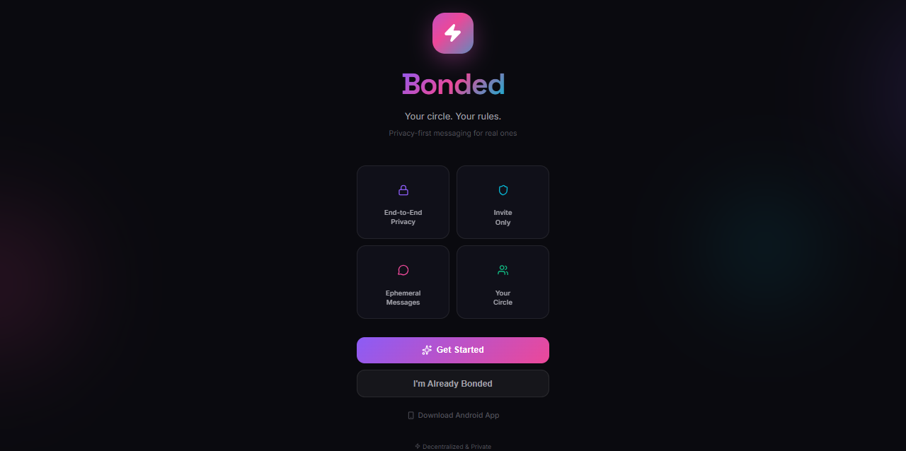

<p align="center">
  
  
  
  
  
  
  
</p>

<h1 align="center">
  ⚡ Bonded
</h1>

<p align="center">
  <strong>Your Circle. Your Rules.</strong><br/>
  <em>Privacy-first, invite-only messaging platform for real ones.</em>
</p>

<p align="center">
  <a href="https://bonded-beta.vercel.app/">🌐 Live Demo</a> •
  <a href="https://bonded-beta.vercel.app/download">📱 Download APK</a> •
  <a href="#-features">✨ Features</a> •
  <a href="#-tech-stack">🛠 Tech Stack</a> •
  <a href="#-getting-started">🚀 Getting Started</a>
</p>

---

## 📖 About

**Bonded** is a next-generation, privacy-first messaging platform designed exclusively for your inner circle. Unlike mainstream messaging apps, Bonded operates on an **invite-only** model — ensuring that your conversations stay between the people who matter most.

Built with cutting-edge technologies including **Next.js 16**, **React 19**, **Supabase Realtime**, and **Firebase Auth**, Bonded delivers a seamless, real-time communication experience wrapped in a stunning dark-mode glassmorphic UI with smooth **Framer Motion** animations.

> 🔒 *"Not everyone deserves to be in your circle. Bonded makes sure only the real ones get in."*

---

## 🖼️ Screenshots

<table>
  <tr>
    <td align="center"><strong>🏠 Landing Page</strong></td>
  </tr>
  <tr>
    <td></td>
    </tr>
</table>

> 🌐 **Live Preview:** [bonded-beta.vercel.app](https://bonded-beta.vercel.app/)

---

## ✨ Features

### 💬 Messaging
| Feature | Description |
|---------|-------------|
| 📨 **Real-time Chat** | Instant message delivery powered by Supabase Realtime subscriptions |
| 🖼️ **Image Sharing** | Send images with optional captions — supports gallery & camera capture |
| 👻 **View-Once Media** | Snapchat-style disappearing images — tap to view, then it's gone forever |
| 🎤 **Voice Messages** | Record and send voice notes with real-time duration counter |
| 🎞️ **GIF Support** | Integrated GIF search & send via Supabase Edge Functions |
| 🔗 **Link Detection** | Auto-detects URLs in messages and makes them clickable |
| 🗑️ **Message Deletion** | Delete your own messages with confirmation modal |
| 📅 **Date Separators** | Smart date grouping (Today, Yesterday, or formatted date) |

### 📞 Calls
| Feature | Description |
|---------|-------------|
| 📱 **Voice Calls** | One-on-one voice calling with WebRTC |
| 🎥 **Video Calls** | Full video calling with camera toggle & mute controls |
| 🔄 **Camera Switch** | Flip between front and rear cameras during video calls |

### 🔐 Privacy & Security
| Feature | Description |
|---------|-------------|
| 🛡️ **Invite-Only Access** | New users require admin approval before accessing the platform |
| 🔒 **End-to-End Privacy** | Messages stay within your trusted circle |
| 👻 **Ephemeral Messages** | View-once images that auto-destruct after viewing |
| ⏱️ **Online Status** | Real-time presence detection with last-seen timestamps |
| 🚫 **Pending Screen** | Unapproved users see a waiting screen until admin grants access |

### 👤 Profile & UX
| Feature | Description |
|---------|-------------|
| 🎨 **Auto Avatars** | Beautiful DiceBear Micah avatars generated from username |
| ✏️ **Editable Profile** | Change display name and update your profile |
| 🌙 **Dark Mode UI** | Stunning glassmorphic dark theme with animated gradient blobs |
| 🎭 **Smooth Animations** | Buttery-smooth transitions powered by Framer Motion |
| 📱 **Mobile First** | Designed for mobile with PWA & native Android APK support |

### 🛠️ Admin Panel
| Feature | Description |
|---------|-------------|
| ✅ **User Approval** | Approve or reject new user registrations |
| 👥 **User Management** | View all registered users and their statuses |
| 🔑 **Role-Based Access** | Admin vs regular user role separation |

---

## 🛠 Tech Stack

<table>
  <tr>
    <th>Category</th>
    <th>Technology</th>
    <th>Purpose</th>
  </tr>
  <tr>
    <td>⚙️ <strong>Framework</strong></td>
    <td></td>
    <td>App Router, SSR, API routes</td>
  </tr>
  <tr>
    <td>⚛️ <strong>UI Library</strong></td>
    <td></td>
    <td>Component-based UI</td>
  </tr>
  <tr>
    <td>📘 <strong>Language</strong></td>
    <td></td>
    <td>Type safety & developer experience</td>
  </tr>
  <tr>
    <td>🗄️ <strong>Database</strong></td>
    <td></td>
    <td>PostgreSQL database, Realtime, Edge Functions, Storage</td>
  </tr>
  <tr>
    <td>🔐 <strong>Authentication</strong></td>
    <td></td>
    <td>Email/username-based auth</td>
  </tr>
  <tr>
    <td>🎨 <strong>Animations</strong></td>
    <td></td>
    <td>Page transitions, micro-interactions</td>
  </tr>
  <tr>
    <td>🎯 <strong>Icons</strong></td>
    <td></td>
    <td>Beautiful, consistent icon system</td>
  </tr>
  <tr>
    <td>📱 <strong>Native App</strong></td>
    <td></td>
    <td>Android APK wrapper with native features</td>
  </tr>
  <tr>
    <td>🔔 <strong>Notifications</strong></td>
    <td></td>
    <td>Push notifications via Firebase Cloud Messaging</td>
  </tr>
  <tr>
    <td>🌐 <strong>PWA</strong></td>
    <td></td>
    <td>Installable web app with offline support</td>
  </tr>
  <tr>
    <td>🚀 <strong>Deployment</strong></td>
    <td></td>
    <td>Zero-config hosting with edge network</td>
  </tr>
</table>

---

## 🏗️ Architecture

```
bonded/
├── 📁 src/
│   ├── 📁 app/                      # Next.js App Router
│   │   ├── 📁 (auth)/               # Auth routes (no bottom nav)
│   │   │   ├── 📁 login/            # Login page
│   │   │   └── 📁 signup/           # Registration page
│   │   ├── 📁 (main)/               # Protected routes (with bottom nav)
│   │   │   ├── 📁 chats/            # Chat list & conversations
│   │   │   │   └── 📁 [id]/         # Individual chat room
│   │   │   ├── 📁 calls/            # Voice & video calls
│   │   │   ├── 📁 profile/          # User profile management
│   │   │   ├── 📁 todos/            # Personal todos/notes
│   │   │   ├── 📁 help/             # Help & support page
│   │   │   └── 📁 privacy/          # Privacy policy
│   │   ├── 📁 admin/                # Admin approval panel
│   │   ├── 📁 download/             # Android APK download page
│   │   ├── 📁 pending/              # Pending approval screen
│   │   ├── 📄 page.tsx              # Landing page
│   │   ├── 📄 layout.tsx            # Root layout (fonts, meta)
│   │   └── 📄 globals.css           # Global theme & design system
│   ├── 📁 components/               # Reusable UI components
│   │   ├── 📄 BottomNav.tsx         # Bottom navigation bar
│   │   ├── 📄 ChatBubble.tsx        # Message bubble component
│   │   ├── 📄 ChatListItem.tsx      # Chat list item component
│   │   └── 📄 PendingScreen.tsx     # Approval waiting screen
│   └── 📁 lib/                      # Shared utilities & hooks
│       ├── 📄 firebase.js           # Firebase config & init
│       ├── 📄 supabase.js           # Supabase client setup
│       ├── 📄 mediaStorage.ts       # Media upload utilities
│       └── 📁 hooks/                # Custom React hooks
│           ├── 📄 useAuth.ts        # Auth state management
│           ├── 📄 useMessages.ts    # Real-time messaging hook
│           └── 📄 useCall.ts        # WebRTC calling hook
├── 📁 public/                       # Static assets
│   ├── 📄 bonded.apk               # Android APK (5.8 MB)
│   ├── 📄 manifest.json            # PWA manifest
│   ├── 📄 firebase-messaging-sw.js # FCM service worker
│   └── 📁 icons/                   # App icons (192x192, 512x512)
├── 📁 android/                      # Capacitor Android project
├── 📄 capacitor.config.ts           # Capacitor native config
├── 📄 next.config.mjs               # Next.js configuration
├── 📄 tsconfig.json                 # TypeScript config
└── 📄 package.json                  # Dependencies & scripts
```

---

## 🚀 Getting Started

### Prerequisites

- **Node.js** ≥ 18.x
- **npm** ≥ 9.x
- A **Supabase** project (for database & realtime)
- A **Firebase** project (for authentication)

### Installation

```bash
# 1. Clone the repository
git clone https://github.com/Muddassirshadab/bonded.git

# 2. Navigate to project directory
cd bonded

# 3. Install dependencies
npm install

# 4. Start development server
npm run dev
```

### Environment Setup

Create your Supabase and Firebase projects, then update the config files:

| File | Purpose |
|------|---------|
| `src/lib/supabase.js` | Supabase URL & anon key |
| `src/lib/firebase.js` | Firebase project config |

### Available Scripts

```bash
npm run dev      # Start dev server (with webpack)
npm run build    # Production build
npm run start    # Start production server
npm run lint     # Run ESLint
```

---

## 📱 Android App

Bonded is also available as a **native Android app** built with [Capacitor](https://capacitorjs.com/). The APK wraps the web app in a native shell with bonus features:

- 🔔 **Push Notifications** via Firebase Cloud Messaging
- 📳 **Haptic Feedback** for enhanced tactile experience
- 🎨 **Native Splash Screen** with brand theming
- 📊 **Dark Status Bar** matching the app theme

**Download:** [bonded-beta.vercel.app/download](https://bonded-beta.vercel.app/download)

---

## 🎨 Design Philosophy

Bonded follows a **premium dark-mode glassmorphic** design language:

| Element | Details |
|---------|---------|
| 🌑 **Background** | Deep dark (`#0a0a0f`) with animated gradient blobs |
| 💜 **Primary Accent** | Purple (`#8B5CF6`) — trust & exclusivity |
| 💗 **Secondary Accent** | Pink (`#EC4899`) — warmth & connection |
| 🩵 **Tertiary Accent** | Cyan (`#06B6D4`) — technology & clarity |
| 🟢 **Success** | Green (`#22C55E`) — online status & confirmations |
| 🔤 **Typography** | Space Grotesk (headings) + Inter (body) |
| 🪟 **Glass Effect** | `backdrop-filter: blur()` with subtle borders |
| ✨ **Animations** | Framer Motion — fade, scale, spring transitions |

---

## 🗄️ Database Schema

Bonded uses **Supabase (PostgreSQL)** with the following core tables:

```sql
-- User profiles & authentication
profiles (id, username, display_name, avatar_url, status, role, last_seen_at)

-- Conversations between users
conversations (id, created_at, updated_at)

-- Many-to-many: users <-> conversations
conversation_members (conversation_id, user_id, last_read_at)

-- Messages with media support
messages (id, conversation_id, sender_id, content, type, media_url, is_one_time, viewed_at, created_at)
```

**Realtime** is enabled on `messages` and `conversation_members` tables for instant updates.

---

## 🔄 Real-time Architecture

```
┌─────────────┐     ┌──────────────────┐     ┌─────────────┐
│   Client A   │────▶│  Supabase        │◀────│   Client B   │
│  (React App) │     │  Realtime        │     │  (React App) │
│              │◀────│  (PostgreSQL     │────▶│              │
│  useMessages │     │   Changes)       │     │  useMessages │
│  useAuth     │     │                  │     │  useAuth     │
│  useCall     │     │  Edge Functions  │     │  useCall     │
└─────────────┘     └──────────────────┘     └─────────────┘
       │                                            │
       │            ┌──────────────────┐            │
       └───────────▶│  Firebase Auth   │◀───────────┘
                    │  (User Identity) │
                    └──────────────────┘
```

---

## 📜 Certificate & Acknowledgments

<table>
  <tr>
    <td>
      <h3>🏆 Certificate of Development</h3>
      <p>This is to certify that <strong>Bonded</strong> — a privacy-first, invite-only messaging platform — has been independently designed, developed, and deployed by <strong>Muddassir Shadab</strong>.</p>
      <br/>
      <table>
        <tr><td><strong>📌 Project</strong></td><td>Bonded — Privacy-First Messaging</td></tr>
        <tr><td><strong>👨‍💻 Developer</strong></td><td>Muddassir Shadab</td></tr>
        <tr><td><strong>📅 Started</strong></td><td>2026</td></tr>
        <tr><td><strong>🌐 Deployed At</strong></td><td><a href="https://bonded-beta.vercel.app/">bonded-beta.vercel.app</a></td></tr>
        <tr><td><strong>📂 Repository</strong></td><td><a href="https://github.com/Muddassirshadab/bonded">github.com/Muddassirshadab/bonded</a></td></tr>
        <tr><td><strong>🛠 Stack</strong></td><td>Next.js 16, React 19, TypeScript, Supabase, Firebase, Capacitor</td></tr>
        <tr><td><strong>📱 Platforms</strong></td><td>Web (PWA) + Android (APK)</td></tr>
        <tr><td><strong>🏷️ Version</strong></td><td>1.0.0 (Beta)</td></tr>
      </table>
      <br/>
      <p><em>This project demonstrates expertise in full-stack web development, real-time systems, mobile app packaging, UI/UX design, and cloud infrastructure management.</em></p>
    </td>
  </tr>
</table>

### 🧰 Skills Demonstrated

- ✅ **Full-Stack Development** — Next.js App Router with TypeScript
- ✅ **Real-time Systems** — Supabase Realtime subscriptions for instant messaging
- ✅ **Authentication & Authorization** — Firebase Auth with role-based access control
- ✅ **WebRTC** — Peer-to-peer voice & video calling
- ✅ **Media Handling** — Image upload, voice recording, GIF integration
- ✅ **Mobile Development** — Capacitor-based Android APK with push notifications
- ✅ **PWA Development** — Installable web app with service workers
- ✅ **UI/UX Design** — Glassmorphic dark theme with Framer Motion animations
- ✅ **Cloud Deployment** — Vercel edge network with Supabase backend
- ✅ **Database Design** — PostgreSQL schema for messaging with realtime triggers

---

## 🤝 Contributing

Bonded is currently in **private beta**. If you'd like to contribute:

1. **Fork** the repository
2. **Create** a feature branch (`git checkout -b feature/amazing-feature`)
3. **Commit** your changes (`git commit -m 'Add amazing feature'`)
4. **Push** to the branch (`git push origin feature/amazing-feature`)
5. **Open** a Pull Request

---

## 📄 License

This project is proprietary software developed by **Muddassir Shadab**. All rights reserved.

---

<p align="center">
  <strong>⚡ Built with passion by <a href="https://github.com/Muddassirshadab">Muddassir Shadab</a></strong>
</p>

<p align="center">
  <a href="https://bonded-beta.vercel.app/">🌐 Website</a> •
  <a href="https://bonded-beta.vercel.app/download">📱 Download</a> •
  <a href="https://github.com/Muddassirshadab">👨‍💻 GitHub</a>
</p>

<p align="center">
  
  
  
</p>
